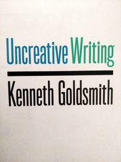

When in the poetry mood (which isn't always), I have a penchant for listening to the podcast [Poem Talk](https://www.poetryfoundation.org/podcasts/series/74633/poemtalk), who manage to find meaning no poet could possibly intend in their own work.

I listen to podcasts in one of two situations: listing in a hot bath or driving, alone.

Enjoyment of the forensic analysis espoused by the roundtable of planet-brained academics on Poem Talk is, after a time, soured by their inevitable inclination towards identity politics, something that seems to infect much of the mainstream poetry coverage I've found online nowadays, so on this particular occasion I pulled in at [Southwaite Services](https://motorwayservices.uk/Southwaite) for a slash and a takeaway cuppa at Greggs.

### Christian B&ouml;k

Sipping my brew and scrolling through alternatives in the car park, I found a podcast whose production values were such that (as I found out ten minutes later) the audio was barely audible above 40mph - but the poet being interviewed was a breath of fresh air.

It was [Christian B&ouml;k](https://en.wikipedia.org/wiki/Christian_B%C3%B6k), a conceptual, experimental poety who's matter of fact talk of process-driven objectivity, poetry-infused DNA, univolics, visual poetry and poetry in science was a shot in the arm after the political platitudes from the sisterhood at Kelly Writers House. Go and read about Christian B&ouml;k - he's the real deal.

### Kenneth Goldsmith

To cut a long story short, and because I want to get this post up as soon as possible, I found Kenneth Goldsmith linked from a web page on Christian B&ouml;k.

Kenneth was a concept artist who switched to poetry and.... To be continued.
